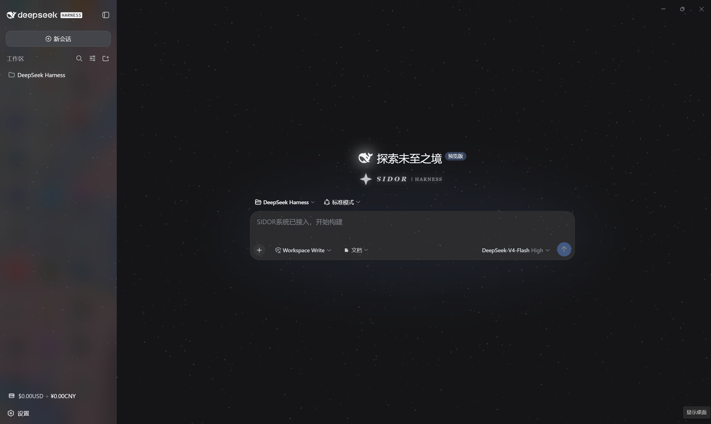
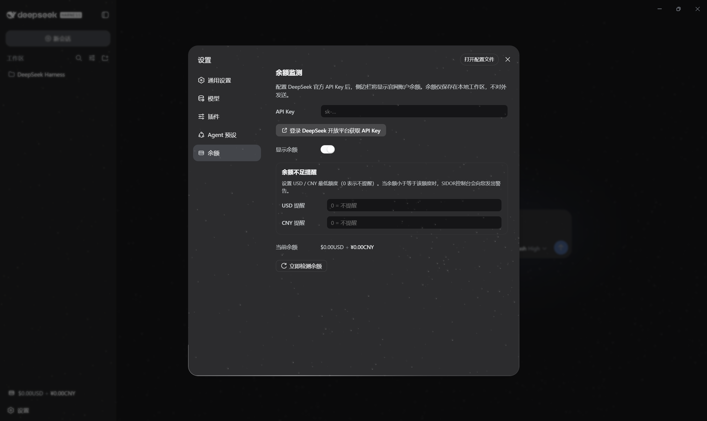
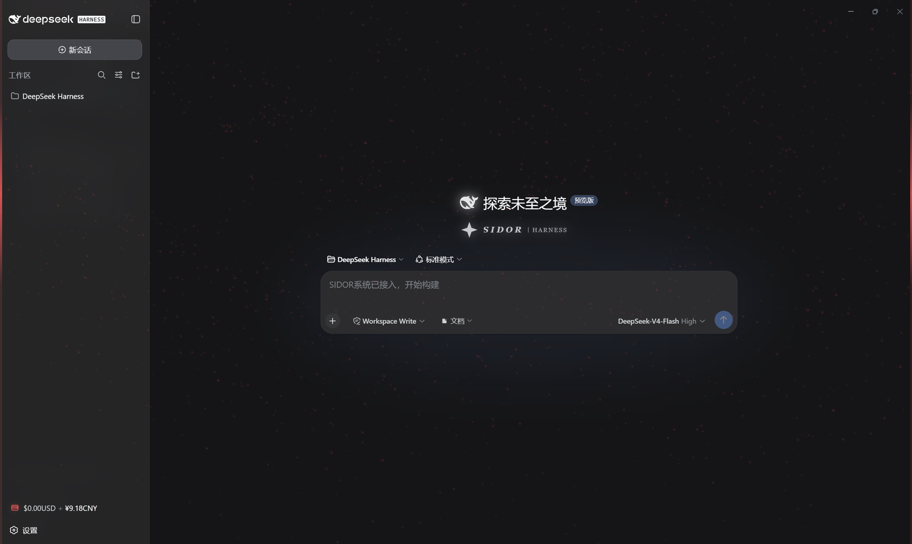

# Sidor_UI · SIDOR 星野控制台皮肤

DeepSeek Harness Web GUI 的 SIDOR 星野主题皮肤（独立分发仓库）。
开屏动画、常驻星野、侧边栏余额徽章、设置页特效与低余额警告体系。

## 效果预览

点击图片可查看完整尺寸。

| 主界面 | 设置页 | 余额不足警告 |
|---|---|---|
| [](preview/hero.png) | [](preview/setting.png) | [](preview/warning.png) |

## 住户

| 皮肤 | 包名 | 说明 | 许可 |
|---|---|---|---|
| [sidor-ui](.) | `sidor-ui` | 星野主题：✦ 开屏粒子动画（1/50 红色太阳风暴彩蛋）、常驻星野、SIDOR 品牌徽记、余额徽章、设置页流光特效、低余额四重红色警告、输入框文档路径附加（agent 工具直接读取）、插件管理（设置→插件列表 关闭/启用/卸载，红色流光二次确认） | MIT |

## 安装

### 懒人版

把你的 dsh 打开，对它说：

```
安装一下这个皮肤包：https://github.com/AKI2253/Sidor_UI
```

> 说明：dsh 助手会 `git clone` / 读取该仓库并自动完成安装。仓库自带 `sidor-install`
> 技能（`.agents/skills/`），会自动询问你确认、交代许可后再安装。

### 本地版（PowerShell，无需 GitHub）

```powershell
cd <Sidor_UI 仓库路径>
powershell -ExecutionPolicy Bypass -File .\scripts\install.ps1            # 安装
powershell -ExecutionPolicy Bypass -File .\scripts\install.ps1 -Remove    # 卸载
```

### 命令版（需 pnpm）

```sh
cd <harness 目录>
dsh plugin --profile web add <Sidor_UI 仓库路径>
```

### 全功能版（动态插件）

动态插件（pluginId `sidf-4`）功能最完整（host curl 查询 + 文件落盘），但进程重启后需在
Cordis 面板重新运行：Client 代码用 `src/sidor-fx-client.js`，Host 代码用
`src/sidor-fx-host.js`。

> **「文档」按钮两种形态都可用**：点击后选择/输入文件或文件夹路径，贴入输入框，
> 由 agent 工具直接读取。静态插件（本地版/命令版）无法把文件落盘到工作区，
> 故路径选择是主要方式（文件夹可用原生选择器，文件请填绝对路径）；
> 动态插件额外保留"上传到工作区 `.sidor-uploads/`"（文件落盘后贴相对路径）。

### 插件管理（设置 → 插件列表）

官方"设置 → 插件"列表里，每张插件卡片会多出「关闭 / 启用 / 卸载」按钮（SIDOR
注入，样式与官方一致）。点击后弹出二次确认菜单，**确认键带红色流光**（防误操作）。
确认后，精确的操作指令会发送给当前会话的 agent 执行（改 `cordis.patch.yml` /
删包），需要权限时 DSH 会弹出授权；完成后**重启 DSH 生效**。

## 许可

本仓库整体以 MIT 发布。SIDOR 品牌标识归本项目所有。署名与使用边界见各皮肤
`NOTICE` / `LICENSE`。

## 未来规划：Sidor 附属插件生态

Sidor_UI 按可扩展平台设计：官方插槽（Slot）的 list 型插槽天然支持多插件共存，
附属插件可无冲突接入设置页（`settings.section`）、侧边栏（`sidebar.footer.action`），
并复用余额数据。开发规范见 [`docs/DEVELOPER.md`](docs/DEVELOPER.md)。

首个附属插件已独立发布（与 Sidor_UI 互相独立的两个插件，可并存）：

| 插件 | 包名 | 说明 |
|---|---|---|
| [Sidor_box](../Sidor_box) | `sidor-box` | 设置页「工具箱」分区（选页先行，功能待填入） |
